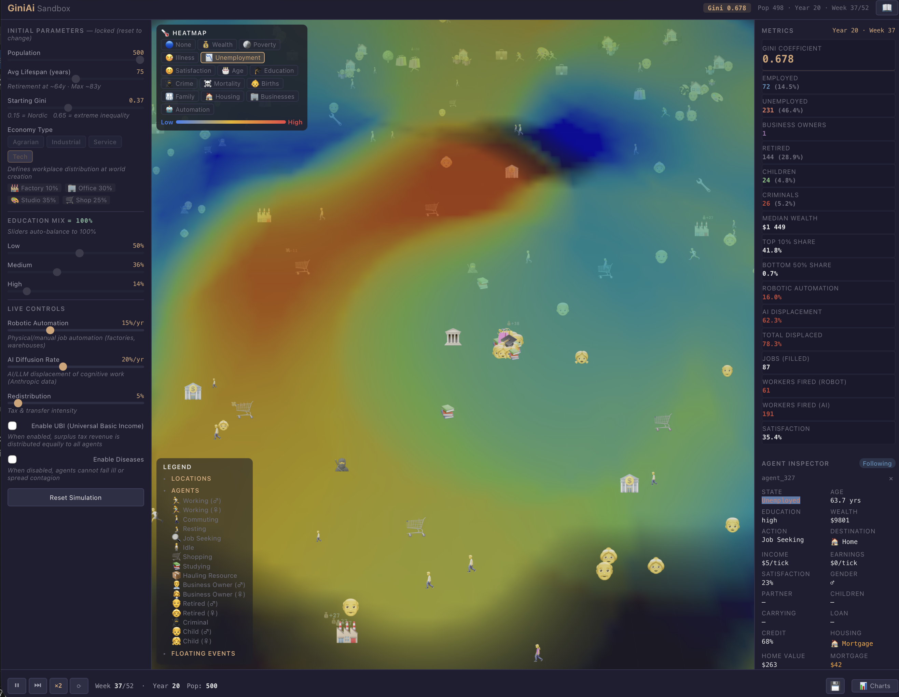
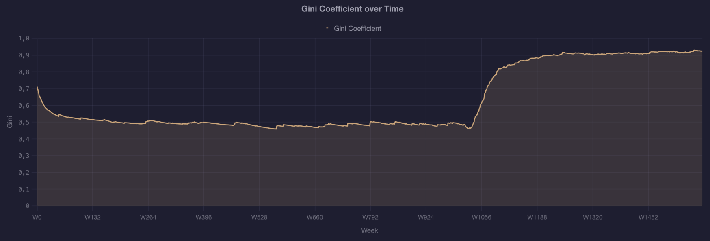
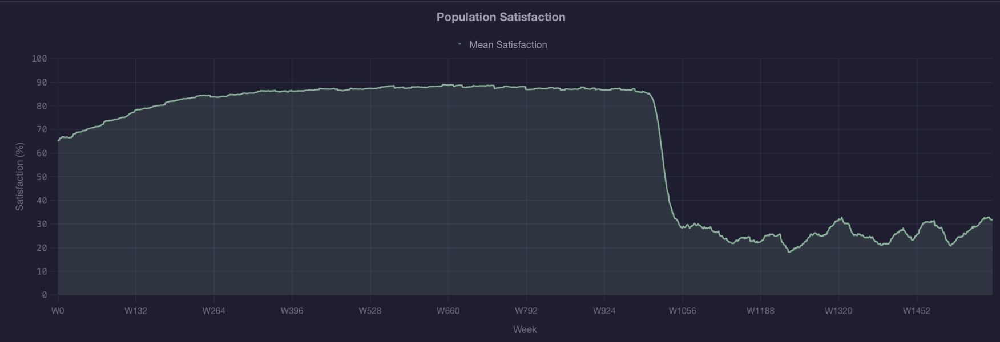
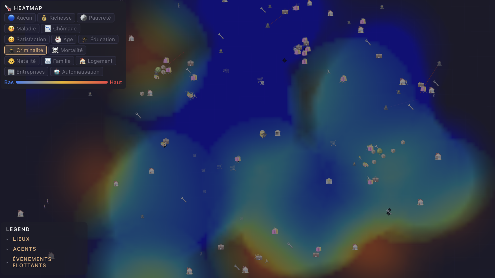
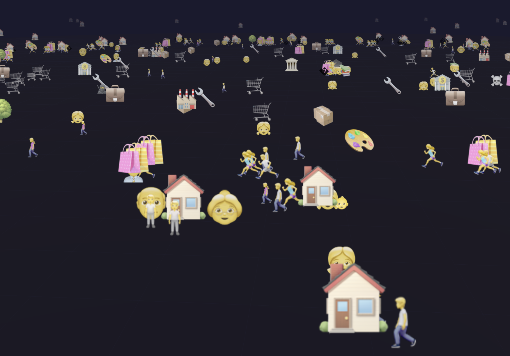
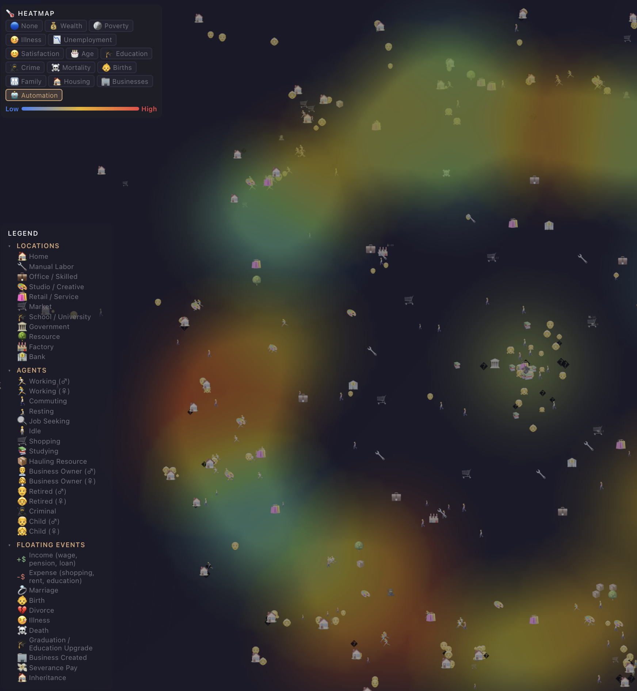
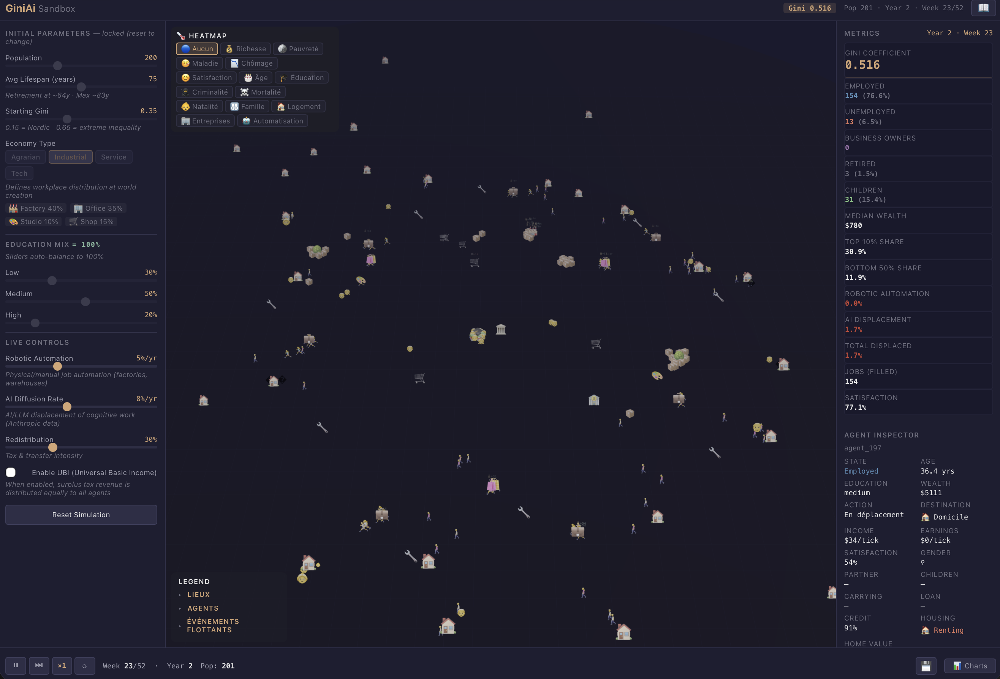

# GiniAi Sandbox

> **An agent-based socio-economic simulation exploring inequality, automation, and redistribution — rendered in real-time 3D.**

[](LICENSE)
[](https://vuejs.org/)
[](https://threejs.org/)
[](https://www.typescriptlang.org/)

---

> **Note:** This is an experimental prototype. The simulation mechanics, parameters, and UI may require further adjusting and enhancing. Contributions and feedback are welcome!

---

## Overview

GiniAi Sandbox is a **fully client-side, real-time simulation** of a miniature economy where hundreds of autonomous agents live, work, marry, have children, get sick, commit crimes, start businesses, retire, and die — all governed by causal mechanics inspired by real-world socio-economic research.

The simulation visualizes how **inequality** (measured by the Gini coefficient) emerges from the interplay of education, employment, automation, taxation, and redistribution.


*Full simulation view: 3D world with emoji agents, location buildings, heatmap overlay, parameter controls, and real-time metrics.*

---

## Features

### Simulation Engine
- **200–500 autonomous agents** with full life cycles (birth → childhood → education → employment → retirement → death)
- **8 location types**: homes, workplaces (manual/skilled/creative/service), markets, schools, government, resource zones, factories, banks
- **Proximity-based interactions**: marriage, contagion, theft, job referrals, criminal influence — all require physical encounter
- **Causal chains**: prolonged unemployment → poverty → crime; poverty + stress → disease → premature death; low satisfaction → divorce
- **Dual-channel automation**: robotic automation (physical jobs) + AI displacement (cognitive jobs, based on [Anthropic Economic Index](https://www.anthropic.com/research/the-anthropic-economic-index) data)
- **Full economic cycle**: wages, taxes, redistribution, pensions, unemployment benefits, UBI, banking/loans, business creation & bankruptcy
- **Housing market**: rent, mortgages, home ownership, government housing expansion
- **Family dynamics**: marriage, children, divorce, inheritance

### Visualization
- **Real-time 3D rendering** with Three.js (instanced meshes for performance)
- **15 heatmap modes**: wealth, poverty, illness, unemployment, satisfaction, age, education, crime, mortality, births, family size, housing, businesses, automation
- **8 chart types**: Gini over time, employment breakdown, wealth distribution, automation displacement, satisfaction, societal phenomena, cross-variable scatter plots
- **Agent inspector**: click any agent to see their full stats, wealth history sparkline, and life event log
- **Location info bubbles**: click any building for description, stats, and economic impact


*Gini coefficient chart showing inequality dynamics — notice the sharp increase when automation kicks in.*


*Mean satisfaction drops dramatically as automation displaces workers, triggering cascading social effects.*

### Controls
- **Initial parameters** (locked after start): population size, starting Gini, average lifespan, education mix, economy type (agrarian/industrial/service/tech)
- **Live controls** (adjustable during simulation): robotic automation rate, AI diffusion rate, redistribution level, UBI toggle
- **Playback**: play/pause, speed control (1x–30x), week/year counter


*Crime heatmap overlay — red zones indicate high criminal activity, often correlating with poverty clusters.*


*Automation metrics: tracking workers fired by robots vs AI, filled jobs declining as displacement accelerates.*


*Agent inspector: full life history, wealth sparkline, and causal event log for any selected agent.*


*Close-up view: emoji agents reflecting diverse states — employed, unemployed, criminals, retirees, children.*

---

## Quick Start

```bash
git clone https://github.com/lejrimostfa/GiniAi-Sandbox.git
cd GiniAi-Sandbox/giniai-sandbox
npm install
npm run dev
```

Open [http://localhost:5173](http://localhost:5173) in your browser.

---

## Tech Stack

| Layer | Technology |
|-------|-----------|
| **Framework** | Vue 3.5 + Composition API |
| **3D Engine** | Three.js r183 |
| **State** | Pinia |
| **Charts** | Chart.js + vue-chartjs + chartjs-plugin-zoom |
| **Events** | mitt (event bus) |
| **Styling** | SCSS + CSS variables |
| **Language** | TypeScript 5.9 |
| **Build** | Vite 8 |

---

## Architecture

```
src/
├── simulation/
│   ├── types.ts              # Agent, Location, SimMetrics, HeatmapMode types
│   ├── SimulationEngine.ts   # Core engine: step(), economy, family, crime, automation
│   ├── WorldGenerator.ts     # Initial world layout and agent creation
│   └── utils.ts              # Math helpers (clamp, distance, Gini calculation)
├── scene/v2/
│   ├── AgentScene.ts         # Three.js scene: agents, locations, heatmap, trails
│   └── ...                   # Camera, materials, rendering
├── components/v2/
│   ├── V2Layout.vue          # Main layout (panels, viewport, playback)
│   ├── ParamsPanel.vue       # Initial parameters + live controls
│   ├── MetricsDashboard.vue  # Real-time metrics display
│   ├── AgentInspector.vue    # Selected agent detail view
│   ├── HeatmapControl.vue    # 15-mode heatmap selector
│   ├── HelpPage.vue          # Interactive help/tutorial
│   ├── SimLegend.vue         # Location/agent/event legend
│   ├── InfoBubble.vue        # Location click info popup
│   ├── V2Charts.vue          # 8 chart tabs with zoom
│   └── PlaybackBar.vue       # Play/pause, speed, timeline
├── stores/
│   └── v2SimulationStore.ts  # Pinia store bridging engine ↔ UI
├── events/
│   └── eventBus.ts           # mitt event bus for decoupled communication
└── styles/
    └── variables.scss        # Design tokens
```

### Design Principles

- **Event-driven architecture**: UI components communicate with the 3D scene exclusively through the event bus — no direct method calls
- **Causal mechanics**: every social phenomenon (crime, disease, divorce) has explicit causes and thresholds, not random dice rolls
- **Proximity-based interactions**: social events require physical co-location of agents, creating emergent spatial patterns
- **Snap-to-location movement**: agents teleport to destinations (1 tick = 1 week), avoiding unrealistic multi-tick commutes

---

## Simulation Mechanics

### Agent Life Cycle
```
Birth → Child (school, age 0-17) → Graduation (age 18) → Unemployed → Employed → Retired → Death
```

### Economy Flow
```
Work → Wage → Tax → Government → Redistribution
                                → Pensions
                                → Unemployment benefits
                                → UBI (if enabled)
```

### Causal Chains
| Trigger | Chain | Outcome |
|---------|-------|---------|
| Unemployment >8 weeks | Low satisfaction → poverty | Crime |
| Poverty + stress >6 weeks | Disease onset | Premature death |
| Satisfaction <0.20 for >5 weeks | Relationship breakdown | Divorce + wealth loss |
| Stable job + high satisfaction | Physical encounter | Marriage |
| Wealth + education + productivity | Bank loan | Business creation |

### Annual Calendar (52 weeks/year)
| Quarter | Event |
|---------|-------|
| **Q1** | Tax Day — workers visit government |
| **Q2** | Job Fair — unemployed seek work |
| **Q3** | Market Festival — everyone shops |
| **Q4** | Health & Education — healthcare + studies |

---

## Build

```bash
npm run build     # Production build (vue-tsc + vite)
npm run preview   # Preview production build locally
```

---

## License

[MIT](LICENSE) — Mostfa Lejri ([@lejrimostfa](https://github.com/lejrimostfa))

---

## Acknowledgments

- Automation displacement model inspired by the [Anthropic Economic Index](https://www.anthropic.com/research/the-anthropic-economic-index) (March 2025)
- Gini coefficient calculation follows the standard Lorenz curve method
- Agent-based modeling concepts from computational social science literature
